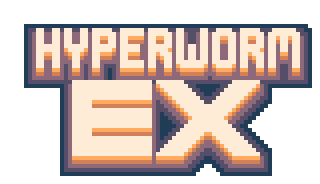

# Hyperworm EX



---

Hyperworm EX is a "3D" FPS written from scratch for the 4MB 2025 Game Jam.

The engine features:
- "3D" Voxel DDA Raycasting
- Raycasted shadows
- Destructible world
- [PL_SYNTH](https://github.com/phoboslab/pl_synth)-powered sound system
- Entity system
- AABB collisions

This is the modified "Post Jam" version, which decouples the rendering,
input and audio backends to ease creation of custom ports.

## Building the Game

The game targets Ubuntu 24.04 as this is the closest Linux distribution
supported for the jam (Linux Mint Wilma).

For Ubuntu, the required packages for the X11 version are:
```sh
$ sudo apt-get -y install build-essential cmake git \
  libX11-dev libglx-dev libgl-dev libasound2-dev
```

The game features multiple selectable backends:
```sh
# Null driver, to test if your compiler is working correctly
-DBACKEND=Null
# GL1/X11 driver (Linux)
-DBACKEND=X11
# Experimental Raylib driver (Cross platform)
-DBACKEND=Raylib
```

The Raylib backend is experimental and may break the game. Please note that
the game was originally designed with X11 and ALSA in mind.

The audio backends are hardcoded per-system:
- Linux: ALSA
- Windows: WinMM
- macOS: No native audio support

You can then build the game using cmake:
```sh
$ mkdir build && cd build
$ cmake -DCMAKE_BUILD_TYPE=Release -DBACKEND=X11 .. && make -j
```

### Building for Windows on Linux

For now, only Mingw-W64 is supported to build the game for Windows:

To build on Ubuntu-based systems:
```sh
# Install required packages
$ sudo apt-get -y install mingw-w64 mingw-w64-common mingw-w64-tools
# Create build directory and build it
$ mkdir build && cd build
$ CC=x86_64-w64-mingw32-gcc CXX=x86_64-w64-mingw32-g++ LD=x86_64-w64-mingw32-ld\
  cmake -DCMAKE_SYSTEM_NAME=Windows -DCMAKE_BUILD_TYPE=Optimized\
  -DBACKEND=Raylib ..
$ make -j
```

## Custom Versions

In the CMakeLists, you can select alternative versions of the game. This was
made to ease the development of the game and help debugging systems.

### Debug

Debug is the full debug version without bell and whistles.
```sh
mkdir build && cd build && cmake -DCMAKE_BUILD_TYPE=Debug .. && make
```

### Profiling

Profiling is a build with basic optimizations, code coverage and gcov enabled:
```sh
mkdir build && cd build && cmake -DCMAKE_BUILD_TYPE=Profiling .. && make
```

While running the game, you will see a gmon.out, which can be used to profile
the game after running it.

On the build folder:
```sh
$ gprof -l PotetreVoxels gmon.out > profiling.txt
```

If you want a granular code coverage for unused code, gcda and gcno can be
found in `build/CMakeFiles/PotetreVoxels.dir/*`.

This build allows to help find and strip out unused or barely used part of game.

### Optimized

Optimized is the target with speed optimization and is portable:
```sh
mkdir build && cd build && cmake -DCMAKE_BUILD_TYPE=Optimized .. && make
```

### Release

Release is the agressively compressed mode:
```sh
mkdir build && cd build && cmake -DCMAKE_BUILD_TYPE=Release .. && make
```

Export the compressed binary (script automatically compiles and zips):

```sh
# In root directory
./tools/export_game.sh
```

This target is only supported for Linux x86. For other systems, this is an
"average" optimized build of the game.

## Licenses

Hyperworm EX, except specific parts, is licensed under the GPLv3 licence or
later. Please see `LICENSE.md` for more details.

The game uses the following libraries:
- PL Synth by Phobos Lab Dominic Szablewski, licensed under the MIT license.
  See `3rdparty/pl_synth.c/h` for more details.
- sts_mixer by Sebastian Steinhauer, under the Unlicense.

Hyperworm EX assets are licensed under the
`Creative Commons Attribution-NonCommercial-ShareAlike 4.0 International`
license. Assets include the following paths:
- promo/*
- include/sounds/*
- include/sprites/*
- music/*.json
- tools/font/*.png
- tool/sprites/*.png

The game uses PoroCYon's [autovndh](https://gitlab.com/-/snippets/1800243)
bruteforce compression script. All rights reserved.

Hyperworm EX uses a modified version of HeraldOD's
[Adapa](https://heraldod.itch.io/adapa) font licensed under
`CC BY 4.0 License`.
